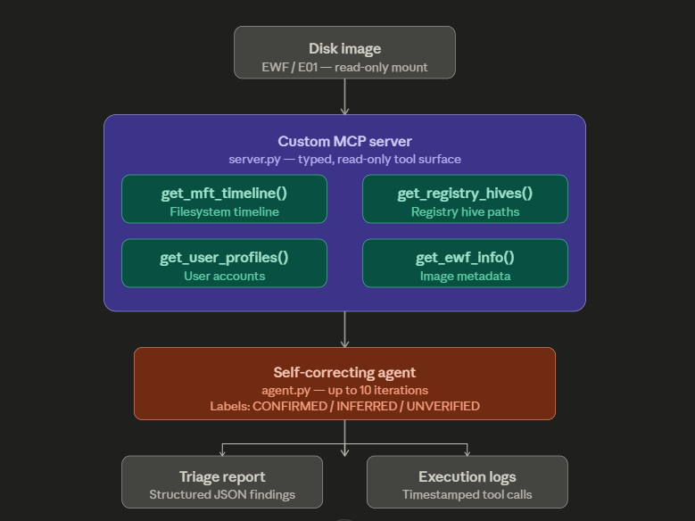

# SIFT MCP Server

Autonomous DFIR triage agent for the SANS SIFT Workstation. Built for the [Find Evil! Hackathon](https://findevil.devpost.com).

## What It Does

Connects an AI agent to SANS SIFT forensic tools through a custom Model Context Protocol (MCP) server. Instead of giving the agent a raw shell, it exposes typed, read-only functions — the agent physically cannot run destructive commands because the server does not expose them.

The agent autonomously triages a disk image, cross-references findings across sources, labels each finding as CONFIRMED / INFERRED / UNVERIFIED, and self-corrects when it finds inconsistencies.

## Architecture



## Requirements

- SANS SIFT Workstation (Ubuntu-based VM)
- Python 3.10+
- Anthropic API key OR Claude Pro/Max account

## Installation

### 1. Download and install the SIFT Workstation

```bash
# Download OVA from:
https://sans.org/tools/sift-workstation
```

### 2. Install Protocol SIFT

```bash
curl -fsSL https://raw.githubusercontent.com/teamdfir/protocol-sift/main/install.sh | bash
```

### 3. Clone this repo

```bash
git clone https://github.com/DithetoMash/sift-mcp-server.git
cd sift-mcp-server
```

### 4. Install dependencies

```bash
pip3 install mcp anthropic --break-system-packages
```

### 5. Set your API key

```bash
export ANTHROPIC_API_KEY="your-api-key-here"
```

## Running a Triage

### Step 1 — Get case data

Download the NIST CFReDS Hacking Case disk image:

```bash
mkdir -p /cases/hacking_case && cd /cases/hacking_case
wget "https://cfreds-archive.nist.gov/images/4Dell%20Latitude%20CPi.E01"
wget "https://cfreds-archive.nist.gov/images/4Dell%20Latitude%20CPi.E02"
```

### Step 2 — Mount the image read-only

```bash
sudo mkdir -p /mnt/ewf_mount /mnt/windows_mount
sudo ewfmount "/cases/hacking_case/4Dell Latitude CPi.E01" /mnt/ewf_mount
sudo mount -o ro,loop,show_sys_files,streams_interface=windows,offset=32256 \
    /mnt/ewf_mount/ewf1 /mnt/windows_mount
```

### Step 3 — Run the triage agent

```bash
cd ~/sift-mcp-server
python3 agent.py
```

The agent will run up to 10 iterations, print findings in real time, and save a structured execution log to `./logs/`.

## Evidence Integrity

Original disk images are mounted read-only at the OS level via `ewfmount`. The MCP server exposes no write tools. The agent cannot modify evidence regardless of what it is instructed to do.

Verify read-only mount:
```bash
mount | grep windows_mount
# Expected output includes: (ro,...)
```

## Output

- **Terminal output** — real-time iteration log with tool calls and reasoning
- **./logs/** — structured JSON execution log with timestamps and token usage
- **Final report** — structured JSON with findings, confidence levels, and recommended next steps

## License

MIT License — see LICENSE file.

## Hackathon

Built for the [Find Evil! IABF Hackathon](https://findevil.devpost.com) — April 15 to June 15, 2026.
